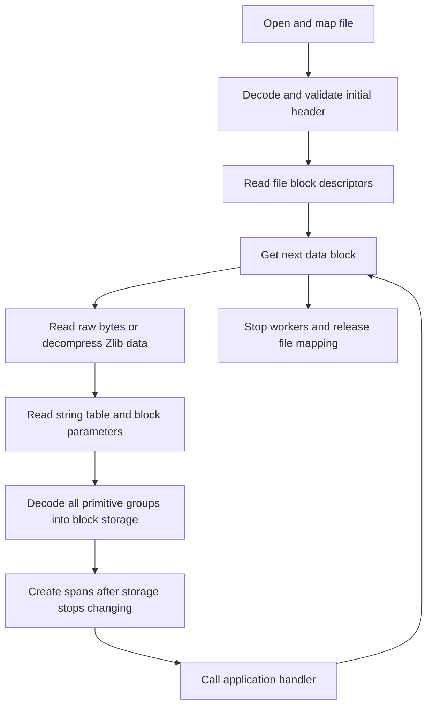

# PBF block callback API proposal

Status: Implemented in version 0.2.0.

Version 0.3.0 replaces this free function with the [PBF reader API](pbf-random-access-proposal.md).
This document records the earlier API contract.

## 1. Purpose

Add an API that calls an application function once for each decoded PBF data block.
Each callback receives all nodes, ways, and relations from that block.
It also exposes the block string table through `std::string_view` entries.
Applications can use a function, a function object, or a lambda.
The `input_file()` API remains available with updated handler and entity types.
Both input APIs use the same entity structures, string views, and standard spans.
This change requires source changes and a rebuild for existing consumers.

This document specifies the API, its behavior, the internal design, and the implementation plan.
The declarations below describe the implemented API.

## 2. Implementation before this change

The review used repository revision `3e05a74`.

| Location | Previous behavior | Required change |
| --- | --- | --- |
| [inputosm.hpp](../include/inputosm/inputosm.hpp), `input_file()` | Accepts three entity handlers. | Add a separate function with one block handler. |
| [inputosm.cpp](../src/inputosm.cpp), `input_file()` | Stores handlers and metadata configuration in global variables. | Keep new callback state in the read operation. |
| [inputosmpbf.cpp](../src/inputosmpbf.cpp), `input_mem()` | Adds all file blocks to a static queue before processing. | Use a queue that belongs to the read operation. |
| `handle_blob()` | Reads raw data or decompresses Zlib data. | Retain these two input forms. |
| `string_table_t` | Copies string bytes into `st_buffer` and adds null characters. | Remove the type. Store `std::vector<std::string_view>` directly. |
| `tag_t` and `relation_member_t` | Use C-string pointers for tag fields and relation roles. | Change these fields to `std::string_view` for both APIs. |
| Removed `include/inputosm/span.h`, `span_t` | Supplies a custom span with read-only element access. | Replace it with `std::span<const T>` at public interfaces. |
| `read_primitve_block()` | Reads the string table, primitive groups, and block parameters. | Collect all primitive groups before the block callback. |
| `read_dense_nodes()` and `read_primitive_group()` | Call entity handlers before the complete block is available. | Separate entity decoding from callback selection. |
| `read_primitive_group()` | Ignores ordinary `Node` messages. | Add ordinary node decoding for complete block results. |
| `input_mem()` and `work()` | Do not return worker failures to the caller. | Return `false` for any stop request or worker failure. |

In that revision, the vectors belong to individual threads.
The decoder clears node vectors for each dense node message.
It clears way and relation vectors for each primitive group.
A collection of the existing spans would therefore contain invalid references.
A complete block needs storage that remains valid until its callback returns.

## 3. Block definition

A file block contains a four-byte length, a `BlobHeader`, and a `Blob`.
The `BlobHeader` identifies the data type and serialized Blob size.
See the [PBF file schema](https://github.com/openstreetmap/OSM-binary/blob/master/osmpbf/fileformat.proto).

For this API, a data block means one `PrimitiveBlock` from one `OSMData` Blob.
A `PrimitiveBlock` contains a string table, block parameters, and a sequence of primitive groups.
Different groups in one block can contain different entity types.
See the [OSM data schema](https://github.com/openstreetmap/OSM-binary/blob/master/osmpbf/osmformat.proto).

The callback receives decoded entities.
It does not receive compressed bytes, Protocol Buffers messages, or one callback for each primitive group.

## 4. Public API

Update the shared entity declarations in `include/inputosm/inputosm.hpp`.
Add the block API declarations to the same header.
The relevant public declarations become:

```cpp
#include <cstddef>
#include <cstdint>
#include <functional>
#include <span>
#include <string_view>

namespace input_osm
{

struct tag_t
{
    std::string_view key;
    std::string_view value;
};

struct node_t
{
    int64_t id = 0;
    int64_t raw_latitude = 0;
    int64_t raw_longitude = 0;
    std::span<const tag_t> tags;
    int32_t version = 0;
    int32_t timestamp = 0;
    int32_t changeset = 0;
};
static_assert(sizeof(node_t) <= 64);

struct way_t
{
    int64_t id = 0;
    std::span<const int64_t> node_refs;
    std::span<const tag_t> tags;
    int32_t version = 0;
    int32_t timestamp = 0;
    int32_t changeset = 0;
};
static_assert(sizeof(way_t) <= 64);

struct relation_member_t
{
    uint8_t type = 0;
    int64_t id = 0;
    std::string_view role;
};

struct relation_t
{
    int64_t id = 0;
    std::span<const relation_member_t> members;
    std::span<const tag_t> tags;
    int32_t version = 0;
    int32_t timestamp = 0;
    int32_t changeset = 0;
};
static_assert(sizeof(relation_t) <= 64);

struct pbf_block_t
{
    size_t index = 0;
    uint64_t file_offset = 0;

    std::span<const std::string_view> string_table;
    std::span<const node_t> nodes;
    std::span<const way_t> ways;
    std::span<const relation_t> relations;

    int32_t granularity = 100;
    int64_t lat_offset = 0;
    int64_t lon_offset = 0;
    int32_t date_granularity = 1000;
};

using pbf_block_handler_t = std::function<bool(const pbf_block_t&)>;

bool input_file(
    const char* filename,
    bool decode_metadata,
    std::function<bool(std::span<const node_t>)> node_handler,
    std::function<bool(std::span<const way_t>)> way_handler,
    std::function<bool(std::span<const relation_t>)> relation_handler) noexcept;

bool input_pbf_blocks(
    const char* filename,
    bool decode_metadata,
    pbf_block_handler_t block_handler) noexcept;

}
```

Both APIs use `tag_t`, `node_t`, `way_t`, `relation_member_t`, and `relation_t`.
Tag keys, tag values, and relation roles use `std::string_view` for PBF, XML, and OSC input.
Their numeric fields retain their current names, types, and meanings.
Relation member types remain 0 for nodes, 1 for ways, and 2 for relations.
`pbf_block_t` and `pbf_block_handler_t` remain specific to block input.
`input_pbf_blocks()` returns `true` only when input completes successfully.
It returns `false` for a stop request or an error.
No separate PBF tag, node, way, relation member, or relation structures are necessary.

All public spans have dynamic extent and const elements.
This preserves read-only access to entities, tags, references, members, and string table entries.
A const span object alone does not make its elements const.
Use `std::span<const T>` at public interfaces.
See the [standard span definition](https://eel.is/c++draft/span.overview).

The handler type follows the existing `std::function` convention.
It accepts function pointers and copyable lambdas, including lambdas with captures.
It does not accept a function object that supports only move operations.

The new name identifies PBF input explicitly.
The function reads PBF content without a filename extension check.
XML input produces `false`.

### 4.1 Block fields

| Field | Meaning |
| --- | --- |
| `index` | File block ordinal, starting with zero for the initial `OSMHeader`. |
| `file_offset` | Byte offset from the file start to the four-byte length field. |
| `string_table` | All string entries in PBF index order, including unused entries and the empty entry at index zero. |
| `nodes` | All ordinary and dense nodes in this data block. |
| `ways` | All ways in this data block. |
| `relations` | All relations in this data block. |
| `granularity` | Coordinate scale in nanodegrees. |
| `lat_offset`, `lon_offset` | Coordinate offsets in nanodegrees. |
| `date_granularity` | Timestamp scale in milliseconds. |

The first data block normally has index 1.
Indexes include skipped file blocks, so successive callbacks can have gaps.
The index identifies file position, not callback order.

### 4.2 Entity values

Entity IDs and references contain the values after delta decoding where applicable.
Each span preserves entity order within its type across all primitive groups.
The three spans do not describe the order between different entity types.
PBF tag fields and relation roles reference the same byte ranges as their corresponding string table entries.
The reader copies view records into these fields without copying string bytes.

The coordinate fields retain the current PBF raw integer values.
The timestamp fields retain the current PBF integer values after delta decoding where applicable.
The block supplies the parameters necessary for unit conversion.

The conversions are:

```text
latitude_degrees = 1e-9 * (lat_offset + granularity * raw_latitude)
longitude_degrees = 1e-9 * (lon_offset + granularity * raw_longitude)
timestamp_seconds = 1e-3 * date_granularity * timestamp
```

These units follow the [PBF format description](https://wiki.openstreetmap.org/wiki/PBF_Format#Definition_of_OSMData_fileblock).
For floating-point results, convert operands before multiplication to prevent integer overflow.

When `decode_metadata` is false, all entity metadata fields contain zero.
When metadata is absent, those fields also contain zero, as in the current entity structures.
The block parameters remain available with either metadata setting.

The new API supports the metadata fields in the current public structures.
These fields are `version`, `timestamp`, and `changeset`.
When metadata decoding is active, a value outside its public field range produces `false`.
This check prevents silent narrowing of PBF 64-bit timestamps and changesets into the existing 32-bit fields.

### 4.3 Callback and lifetime rules

- Each successfully decoded data block causes exactly one callback during a completed read.
- A valid data block without entities still causes one callback with three empty spans.
- A block with a decoding error causes no callback for that block.
- Each callback receives all supported entities from its block, including entities in later primitive groups.
- The block object and all referenced data remain valid until the callback returns.
- Referenced data includes tags, strings, node references, and relation members.
- String table views borrow bytes from the mapped file or the worker decompression buffer.
- Copying a string view does not copy its bytes or extend their lifetime.
- A copy of `pbf_block_t` does not extend data lifetime.
- The reader can reuse all block storage after the callback returns.

To retain entities, copy their referenced data into application storage before the callback returns.
Do not put borrowed spans or pointers in a queue for subsequent processing.

### 4.4 Threads and order

The function reads `thread_count()` once at entry.
It uses that value for the complete read operation.

| Thread count | Callback behavior |
| --- | --- |
| 1 | Callbacks run in the calling thread, in file order. |
| More than 1 | Worker threads can call the same handler concurrently. Callback order can differ from file order. |

During each callback, `thread_index` identifies its worker and `block_index` equals `pbf_block_t::index`.
The worker index is less than the thread count for this operation.
The operation sets `file_type` to `file_type_t::pbf` and `osc_mode` to `mode_t::bulk`.

For ordered callbacks, call `set_thread_count(1)` before the read operation.
For concurrent callbacks, protect shared application data with synchronization.
If the handler captures application objects by reference, keep those objects alive until `input_pbf_blocks()` returns.

Concurrent read operations and recursive reads remain unsupported.
Do not call either input API while another input operation is active.
Do not change thread or log configuration during a read operation.
Internal state isolation does not make the existing global configuration safe for concurrent changes.

### 4.5 Completion, cancellation, and errors

| Event | Result and behavior |
| --- | --- |
| End of valid input; all callbacks returned `true` | Return `true`. |
| A callback returns `false` | Request cancellation. Return `false`. |
| Invalid path, null filename, or empty handler | Return `false` without a block callback. |
| File, framing, decompression, decoding, or resource failure | Request cancellation. Return `false`. |
| A callback throws | Catch the exception. Request cancellation. Return `false`. |

The Boolean result does not distinguish a stop request from an error.
The reader reports errors through the existing log API.
For block errors, the log includes the block index and file offset when available.

With one thread, a stop request prevents all subsequent callbacks.
With multiple threads, callbacks that already have permission to run can start or finish after the stop request.
The reader gives no further callback permission after it records cancellation.
All workers stop before the function returns.
No callback or reference to the handler survives the function return.

Cancellation does not undo application changes from earlier callbacks.
It does not validate the unread remainder of the file.
The reader still reports errors detected during cancellation.
Such errors also produce `false`.

The `noexcept` guarantee starts when the function body begins.
Construction or copying of the `std::function` argument can throw before entry.
Log callbacks must not throw.

### 4.6 String table access

`block.string_table[i]` exposes the bytes for PBF string index `i`.
The table includes strings that no decoded entity references.
It remains complete when `decode_metadata` is false.
The reader preserves entry order, duplicate entries, empty strings, and embedded null characters.
It does not sort or remove duplicate entries.

Each view supplies a pointer and a byte count.
It does not own the bytes and does not guarantee a final null character.
See the [C++ string view access rules](https://eel.is/c++draft/string.view.access).
Use the view directly with functions that accept `std::string_view`.
Do not pass `view.data()` to `strcmp()`, `strlen()`, or `%s` formatting.

The zero-copy requirement applies to string bytes after Blob decoding.
Zlib decompression still writes the uncompressed block into a worker buffer.
The reader still allocates view records and decoded entities.
Copies of pointer and length values do not copy string bytes.

The PBF schema requires a string table in each `PrimitiveBlock`.
Its index-zero entry must be empty.
See the [StringTable definition](https://github.com/openstreetmap/OSM-binary/blob/master/osmpbf/osmformat.proto).
A missing table, a table without entries, or a nonempty index-zero entry produces `false` before the callback.
A valid block without entities still exposes its string table, including the empty index-zero entry.
The API therefore needs no optional table field or separate presence flag.
Headers do not produce block callbacks.

## 5. Usage example

This example counts all entities with ordered callbacks:

```cpp
#include <inputosm/inputosm.hpp>

#include <cstdint>
#include <cstdlib>
#include <fmt/format.h>
#include <cstdio>

int main(int argc, char** argv)
{
    if (argc != 2)
    {
        fmt::print(stderr, "Usage: count_blocks <file.osm.pbf>\n");
        return EXIT_FAILURE;
    }

    input_osm::set_thread_count(1);
    uint64_t blocks = 0;
    uint64_t nodes = 0;
    uint64_t ways = 0;
    uint64_t relations = 0;

    const bool result = input_osm::input_pbf_blocks(
        argv[1], false,
        [&](const input_osm::pbf_block_t& block) {
            ++blocks;
            nodes += block.nodes.size();
            ways += block.ways.size();
            relations += block.relations.size();
            return true;
        });

    if (!result)
    {
        fmt::print(stderr, "Input did not complete\n");
        return EXIT_FAILURE;
    }

    fmt::print("blocks={} nodes={} ways={} relations={}\n",
               fmt::group_digits(blocks),
               fmt::group_digits(nodes),
               fmt::group_digits(ways),
               fmt::group_digits(relations));
    return EXIT_SUCCESS;
}
```

A function pointer uses the same interface:

```cpp
bool print_block(const input_osm::pbf_block_t& block)
{
    fmt::print("{} {}\n", block.index, block.file_offset);
    for (size_t index = 0; index < block.string_table.size(); ++index)
        fmt::print("{}: {}\n", index, block.string_table[index]);
    return true;
}

void print_all_blocks(const char* filename)
{
    input_osm::set_thread_count(1);
    const bool result = input_osm::input_pbf_blocks(
        filename, false, print_block);
    if (!result)
        fmt::print(stderr, "Input did not complete\n");
}
```

To stop after the first data block, return `false` from the handler with one thread.
The read operation then returns `false`.
A valid file with only its header returns `true` without a callback.

New block consumers can compare tag views directly:

```cpp
bool contains_ferry(const input_osm::pbf_block_t& block)
{
    for (const auto& way : block.ways)
        for (const auto& tag : way.tags)
            if (tag.key == "route" && tag.value == "ferry")
                return true;
    return false;
}
```

Call `contains_ferry()` inside an input handler to test a block.
The same tag comparison works in an `input_file()` handler.
Section 7 describes the required changes for existing consumers.

## 6. Internal design

### 6.1 Processing sequence



The single-thread path uses this sequence directly.
The multiple-thread path uses the calling thread for file scanning and worker threads for decoding and callbacks.
Each worker processes one complete data block at a time.

### 6.2 Read operation state

Use a private context for each new API call.
The context contains the handler, metadata setting, thread count, work queue, cancellation state, and final result.
The context owns the file mapping until all workers stop.
Each worker owns its decompression buffer and decoded block storage.
Each worker also owns its string table views.
Workers do not share string table storage.

Limit the queue to twice the number of workers.
Queue entries contain offsets, sizes, and indexes into the mapped file.
The producer waits when the queue is full.
Cancellation wakes both the producer and workers.
The single-thread path needs no queue.

A mutex protects queue changes, callback permission, and result changes.
A worker gets callback permission only after successful decoding and a cancellation check under this mutex.
The worker releases the mutex before it calls application code.
After the callback, the worker records any stop request or exception under the same mutex.
Thus, cancellation does not hold a lock across application code.
Any stop request or failure sets the operation result to `false`.
No subsequent worker success can change that result to `true`.
Return `true` only after successful end-of-input processing, worker shutdown, and resource cleanup.

### 6.3 Decoded block storage

Use private vectors for entities, tags, node references, relation members, and string views.
Keep numeric offsets for references while vectors can grow.
After all groups are complete, convert offsets into spans.
Do not append to these vectors during the callback.

The string table belongs to the complete block.
Reset coordinate and timestamp parameters to their schema defaults before each block.
Read the string table and parameters before entity decoding, regardless of their field order.
Protocol Buffers permits fields in different orders and multiple segments for repeated fields.
See the [Protocol Buffers encoding rules](https://protobuf.dev/programming-guides/encoding/).

The block mode must collect every group without the current per-group vector clears.
It must support ordinary `Node` messages and `DenseNodes` messages.
Delta accumulators reset at each applicable message or entity boundary.
Storage growth must not cause repeated callbacks or stale pointers.
Complete the string view vector before creating `pbf_block_t::string_table`.
Keep the uncompressed block bytes unchanged until the callback returns.
Do not resize or reuse its decompression buffer while any callback uses those bytes.

### 6.4 Decoder integration

Separate private decoding functions from global callback variables.
Pass metadata configuration, storage, and an internal delivery mode explicitly.
The block mode delivers one complete block.
The existing entity mode retains its current batch boundaries and optional entity handlers.
Do not implement the existing API by splitting the new block callback into three callbacks.
That approach changes batch boundaries and forces complete block storage on existing applications.

Share field readers, decompression, and entity decoding where their behavior agrees.
Keep callback selection and storage reset points specific to each delivery mode.
Do not store the new block handler in a global variable.
Both delivery modes create the same entity types and use the same string view lookup.
String representation requires no decoder variant, adapter, or output conversion.
Do not create a complete PBF entity block as an intermediate step for `input_file()`.

### 6.5 Input checks and supported content

The new API requires an initial `OSMHeader` before data processing.
It accepts `OsmSchema-V0.6` and `DenseNodes` as required features.
It rejects other required features, including `HistoricalInformation`.
The public entities cannot describe history visibility.
Unknown optional features do not cause an error.

The reader skips unknown file block types after it checks their framing.
These blocks receive indexes but no callbacks.
A second `OSMHeader` produces `false` in this initial API version.
Raw and Zlib data are supported; other compression types produce `false` for known block types.

Before reading data, check lengths against the remaining input size.
Reject truncated fields, invalid varints, invalid string indexes, and inconsistent entity arrays.
Skip unknown Protocol Buffers groups with a maximum nesting depth of 64.
Check delta arithmetic and conversions for overflow.
Reject unsupported `ChangeSet` entities instead of silently omitting them.
Ignore optional entity fields that the current public structures do not expose.
For example, the API does not expose user names or coordinates attached to ways.

Require BlobHeader sizes below 64 KiB and uncompressed Blob sizes below 32 MiB.
These limits follow the [PBF size requirements](https://wiki.openstreetmap.org/wiki/PBF_Format#File_format).
Check serialized Blob sizes against the mapped file before pointer arithmetic.
Require decompression output to match the declared raw size.
Trailing bytes that cannot form a complete file block produce `false`.
An empty file or a missing header also produces `false`.

### 6.6 Resource and exception handling

Use resource objects that close file descriptors and release mappings on every exit path.
If thread creation fails, request cancellation.
Then join the workers that already started.
Catch allocation and callback exceptions at the worker or calling-thread boundary.
Remove `noexcept` from private functions that must pass these exceptions to that boundary.
An outer catch cannot intercept an exception that already caused termination in a private `noexcept` function.
Retain the public `noexcept` declarations.

### 6.7 Cost

The new mode retains one complete decoded block for each active worker.
Decoded structures can require more memory than their uncompressed PBF bytes.
Additional memory depends on worker count, block contents, and retained vector capacity.
It does not require decoded storage for the complete file.
The file mapping still covers the complete input file.

The new mode adds one `std::function` call for each data block.
It can use more memory than the existing entity mode when blocks contain many groups.
Measure this cost before any change to vector capacity retention.
No new runtime dependency is necessary.
libdeflate checks the compressed input length and exact output size.

String views remove the secondary string byte buffer from both PBF delivery modes.
View records still require memory for both a pointer and a length.
Tag records and relation members can therefore exceed the size of their current C-string equivalents.
Measure both the removed byte storage and the additional view records.
XML and OSC retain owned string storage as described in section 6.9.

### 6.8 Direct string table storage

Remove the custom `string_table_t` type, its methods, `st_index`, and `st_buffer`.
Use a `std::vector<std::string_view>` named `string_table` directly in the private worker state.
Include `<vector>` and `<string_view>` in the implementation.
Both PBF delivery modes use this vector without a wrapper or compatibility byte buffer.
The public block exposes `std::span<const std::string_view>` over the vector entries.

1. Clear the vector at the start of each primitive block.
2. Validate each string field against the remaining block bytes.
3. Construct each view from the field pointer and its byte count.
4. Append the view with `string_table.emplace_back()` in PBF index order.
5. Validate each lookup index before access.
6. Assign `string_table[index]` directly to the tag field or relation role.
7. Create the public table span after all table entries are complete.
8. Clear the views before releasing or reusing their source bytes.

Reject out-of-range string indexes before conversion to `uint32_t`.
`string_table.clear()` retains vector capacity without access to referenced bytes.
`emplace_back()` stores only the pointer and length.
It does not copy characters or add a null character.
Remove `init(byte_size)`; a byte count is not a string count.
Replace each `get(index)` call with a bounds check and vector access.
Vector growth can move view records without moving the string bytes.
The public table span must not survive vector growth.

For a raw Blob, the views point into the read-only file mapping.
For a Zlib Blob, the views point into the worker decompression buffer.
Both buffers remain valid and unchanged for every callback that uses their bytes.
The entity delivery mode can therefore reuse views across several callbacks within one primitive block.
The block delivery mode uses them in one complete block callback.
Do not write null characters into either buffer.
Such a write can overwrite another field and cannot support read-only mapped input.

Update every tag lookup in `read_dense_nodes()`, `read_way()`, and `read_relation()`.
Update the relation role lookup in `read_relation()`.
Use the same vector access for the proposed ordinary node decoder.
Copy the full view into each field to preserve its byte count.

### 6.9 XML and OSC string storage

The shared entity changes also apply to `src/inputosmxml.cpp`.
Keep its `current_strings` storage as `std::vector<std::string>`.
This storage keeps attribute bytes alive until the entity callback.
The PBF zero-copy requirement does not remove XML attribute storage.

1. Continue to store attribute text while reading an entity.
2. Keep tag indexes and role indexes until the entity is complete.
3. Construct string views from the complete stored strings at the entity end.
4. Construct the entity's `std::span<const T>` fields.
5. Call the corresponding entity handler.
6. Clear the storage after the callback returns.

Construct views from the stored strings and their lengths without a C-string length scan.
Do not construct persistent views while `current_strings` can grow.
Vector growth can move strings and invalidate views, including views of short strings.
Do not retain pointers to parser attributes for the later entity callback.
Represent an absent or empty relation role with an empty `std::string_view`.
The public types do not distinguish absence from an empty string.
Keep XML entity values and OSC operation modes unchanged.

### 6.10 Standard span migration

Replace `span_t` throughout public headers, parser declarations, callback construction, tests, and examples.
Use `std::span<const T>` for borrowed input data at each public boundary.
This requirement includes nested entity fields and all three `input_file()` handlers.
Private buffers can remain mutable during decoding.

Remove `include/inputosm/span.h` and its `makeSpan()` helper.
Remove includes of that header.
Use `<span>` and standard constructors instead.
Do not retain a `span_t` alias or a compatibility overload.
Validate signed counts before conversion to `std::size_t`.
Keep input bounds checks before span indexing; span access does not replace validation.
Use `begin()` and `end()` for the C++20 interface.

Add `target_compile_features(inputosm PUBLIC cxx_std_20)` to the library target.
This requirement must reach consumers through the installed CMake target.
The project already builds with C++20; no newer language version is necessary.

## 7. Consumer migration and scope

The shared entity changes intentionally break source and binary compatibility.
The library does not preserve the old C-string fields, custom span type, or handler signatures.
Release the implementation with a package version change.
Rebuild the library and all dependent applications together.

`input_file()` retains its name, filename and metadata arguments, three-handler model, and Boolean result.
Its handler parameter types become `std::span<const node_t>`, `std::span<const way_t>`, and `std::span<const relation_t>`.
Applications still select entity callbacks or the additional block callback API.
The new cancellation contract applies to `input_pbf_blocks()`.
The shared PBF executor also corrects lost stop and failure results in `input_file()`.
The PBF tests verify this correction for both APIs.

### 7.1 Required consumer changes

| Current use | Replacement |
| --- | --- |
| `input_osm::span_t<T>` | `std::span<const T>` for input callbacks and borrowed entity data. |
| `inputosm/span.h` | Standard header `<span>`. |
| `makeSpan(data, count)` | `std::span<const T>{data, count}` with a checked count. |
| `strcmp(tag.key, "route") == 0` | `tag.key == "route"`. |
| `strlen(tag.value)` | `tag.value.size()`. |
| `const char* role = member.role` | `std::string_view role = member.role`. |
| Pointer checks on tags or roles | Remove presence checks; use `.empty()` only to test whether text has zero length. |
| Retain a tag value or role after a callback | Construct an owning `std::string` from the view. |
| A function that requires a C string | Construct an owning string before passing its `c_str()` pointer. |

Empty tag values remain valid data.
Do not replace every pointer check with an emptiness check that removes those values.
No tag key, tag value, or relation role has a public null-termination guarantee.
Do not replace C-string arguments with `.data()` alone.
The same rules apply to PBF, XML, and OSC consumers.

Update [extract_ferries.cpp](../test/integration/extract_ferries.cpp) to compare views directly.
Update [export_db.cpp](../test/integration/export_db.cpp) to write strings with explicit lengths.
For its null-delimited output, write the view bytes followed by a separate null byte.
If the view is empty, write only the delimiter.
Keep the example's output record format unchanged.
Update every integration example and unit test that declares an entity handler or consumes string fields.

### 7.2 Retained behavior and exclusions

Shared decoder changes require tests for the existing PBF entity callbacks.
Ordinary node support is an intentional correction if the existing path uses the new ordinary node decoder.
Record any such behavior correction in its implementation change.

This proposal excludes raw block access, random access, iterator objects, and a public block ownership type.
It also excludes ordered callbacks with multiple workers and simultaneous use of both callback APIs in one read operation.
These features need separate use cases before API expansion.

## 8. Implementation plan

1. Add small PBF test fixtures for the existing entity API.
2. Change shared tag fields and relation roles to string views.
3. Replace custom spans in entity fields, handlers, and implementations with standard spans.
4. Remove the custom span header and helper.
5. Replace the custom string table with a direct vector of string views.
6. Update XML and OSC view construction and storage lifetime.
7. Add the block API declarations and their comments.
8. Add private read operation state and checked block descriptors.
9. Add header validation before worker dispatch.
10. Separate entity decoding from handler invocation.
11. Add ordinary node decoding and complete block storage.
12. Add the single-thread path with `true` for completion and `false` for cancellation or failure.
13. Add the worker queue and shared cancellation state.
14. Add exception handling and resource cleanup on every exit path.
15. Migrate existing tests and integration examples to the shared types.
16. Add block API tests and the block callback example.
17. Update package requirements, API documentation, and consumer migration instructions.
18. Measure both API modes with the same PBF input and thread counts.

| File | Planned change |
| --- | --- |
| `include/inputosm/inputosm.hpp` | Use `<string_view>` and `<span>`. Update shared types and `input_file()`. Add the block API declarations and comments. |
| `include/inputosm/span.h` | Remove the header, custom span type, and helper. |
| `src/inputosmpbf.cpp` | Remove `string_table_t`. Use a direct view vector. Add block storage, dispatch, the new entry point, and read operation state. |
| `src/inputosm.cpp` | Update handler storage and `input_file()` parameters to standard spans. Adapt private PBF dispatch where necessary. |
| `src/inputosmxml.cpp` | Update handler declarations, tag fields, relation roles, and span construction. Preserve owned XML string storage. |
| `test/unit/pbf_block_test.cpp` | Add deterministic block, cancellation, error, shared type, and zero-copy tests. |
| `test/unit/read_osm_test.cpp`, `test/unit/read_osc_test.cpp` | Update handler types and string consumers. Verify XML and OSC view lifetime. |
| `test/unit/data/` | Add small PBF fixtures and documented expected values. |
| `test/unit/CMakeLists.txt` | Register the PBF unit test. |
| `test/integration/count_blocks.cpp` | Add a complete example for block callbacks. |
| `test/integration/*.cpp` | Migrate existing examples to standard spans and string view access. |
| `test/integration/CMakeLists.txt` | Register the example target. |
| `CMakeLists.txt` | Export the C++20 requirement. Change the package version before release. |
| `README.md` | Document both APIs, source migration, data lifetime, and the incompatible type changes. |

The current installation rule includes public headers automatically.
The proposal requires no new public header or library dependency.
Verify that a clean installation excludes the removed `span.h` header.

## 9. Acceptance tests

Use small fixtures with independently specified expected values.
Use synchronization barriers for concurrent callback tests instead of timing assumptions.

| Test | Required result |
| --- | --- |
| Function pointer and captured lambda | Both compile and receive the expected blocks. |
| Multiple data blocks | Exactly one callback for each block on completion. |
| Multiple groups of the same type | The callback includes entities from every group. |
| Different entity types across groups | One callback contains all three entity spans. |
| Ordinary and dense nodes | All nodes appear once with correct IDs, tags, and coordinates. |
| Complete string table | Preserve index order, duplicates, unused entries, and entries used only by metadata. |
| Metadata decoding disabled | Expose the same complete string table. |
| Empty strings and embedded null characters | Preserve exact byte counts and contents in views. |
| Missing table, no entries, and nonempty index-zero entry | Return `false` before the block callback. |
| Empty entity block with a valid table | Expose the table and call the handler once. |
| Raw and Zlib string views | Table views point into the original uncompressed block bytes for each path. |
| PBF tag and role views in both APIs | Match the pointer and length of the referenced table entry. |
| String storage in both PBF modes | Use the direct view vector without string byte copies after Blob decoding. |
| Shared entity types | Both APIs use the same node, way, relation, tag, and relation member types. |
| Public standard spans | Expose const elements for entity batches, tags, references, members, and string table entries. |
| Migrated string consumers | Compare views and use explicit lengths correctly, including empty tag values and relation roles. |
| String indexes outside the table or `uint32_t` range | Reject the input before narrowing or lookup. |
| XML string storage growth | Tag and role views remain valid during callbacks after many short and long strings. |
| XML absent or empty roles | Expose empty views without construction from a null C-string pointer. |
| View vector growth and worker buffer reuse | No stale table span, tag view, or relation role during a callback. |
| Storage growth | Earlier groups retain correct tags, strings, references, and roles during the callback. |
| Raw and Zlib Blobs | Both produce the same decoded values. |
| Empty data block and file with only a header | Respectively, one empty callback and no callbacks; both complete. |
| Header plus unknown block type | No callback for either; later indexes and offsets match physical file positions. |
| Nondefault block parameters followed by omitted parameters | The second block uses schema defaults. |
| Reordered fields and split repeated fields | Entity values remain correct. |
| Metadata on, off, absent, and outside the field range | Values and error results match section 4.2. |
| One thread | Callbacks use the calling thread and follow file order. |
| Multiple threads | No duplicate blocks; correct worker indexes; valid data in overlapping callbacks. |
| Stop in the first callback with one thread | One callback and `false`. |
| Stop with multiple threads | Return `false` after all workers stop. Only callbacks with prior permission can continue. |
| Worker failure during cancellation | Final result is `false`. |
| Callback exception | Return `false` without process termination or a surviving worker. |
| Missing file, null filename, empty handler, XML, and empty input | Return `false` without a block callback. |
| Invalid header, unsupported required feature, and second header | Return `false`; dispatch no subsequent data callbacks. |
| Unsupported compression and damaged Zlib data | Return `false` without a callback for the failed block. |
| Truncation, trailing bytes, size limits, invalid indexes, and overflow | Return `false` without invalid memory access. |
| Failed or stopped read followed by a valid read | No stale queue entries, handler state, or block parameters. |
| PBF entity API | Updated standard span handlers retain the existing batch boundaries and optional-handler behavior. |
| XML, OSC, and thread configuration tests | Migrated tests preserve expected entity values and change modes. |
| Installed CMake consumer | The exported target supplies C++20; a minimal consumer compiles with the new public header. |
| Migrated export example | Output retains the expected record layout and string delimiters. |

For memory tests, use AddressSanitizer and UndefinedBehaviorSanitizer builds.
For worker tests, use a separate ThreadSanitizer build where supported.
Use private decoder tests to compare view addresses with the source byte ranges.
Check string storage with private instrumentation.
Keep this instrumentation private to the tests.
Run the migrated integration examples against small PBF fixtures.
Compare entity totals from both APIs for fixtures that the current decoder supports.
Measure elapsed time and peak resident memory for one thread and multiple threads.
The release requires correct results and an explanation of any measured performance change.

## 10. Design choices

| Choice | Reason |
| --- | --- |
| Separate PBF function | Makes format and callback granularity explicit without an overload of `input_file()`. |
| Complete decoded block | Lets applications process related entities together at the physical block boundary. |
| Borrowed spans and string views | Give access to block storage without copying string bytes or transferring ownership. |
| Shared entity types with string view fields | Removes duplicate entity structures and supports the same string access in both APIs. |
| `std::span<const T>` | Replaces the custom span while retaining read-only public access. |
| Direct `std::vector<std::string_view>` | Replaces the custom string table without copying PBF string bytes. |
| Complete public string table | Preserves PBF indexes and exposes all strings, including unused entries. |
| Incompatible source and binary update | Permits removal of C-string fields, compatibility copies, and custom span interfaces. |
| Required string table | Rejects missing tables in accordance with the PBF schema. |
| Boolean result | Returns `true` for successful completion and `false` for cancellation or failure. |
| Existing thread configuration | Retains the library's current control for sequential and parallel input. |
| Separate entity delivery mode | Preserves existing batch boundaries and avoids mandatory block storage for existing callers. |

The initial implementation should use these choices without additional options.
An owning block type or a raw byte callback can follow if an application needs data beyond callback return.
